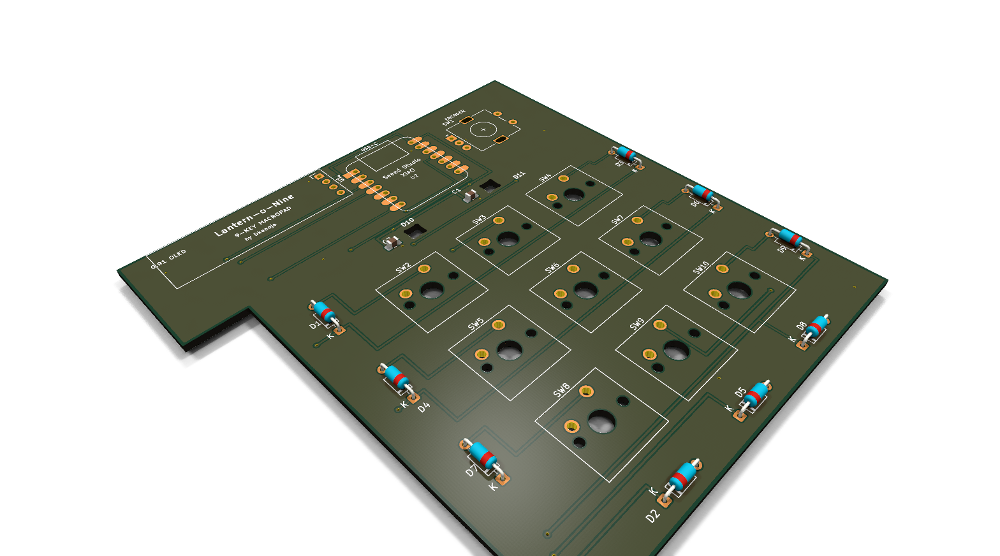
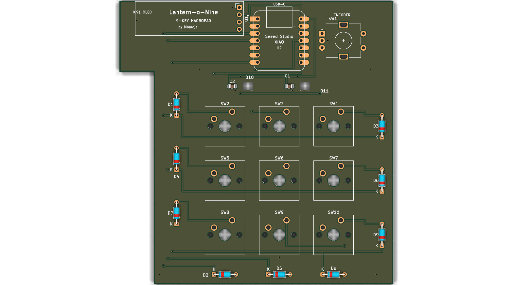
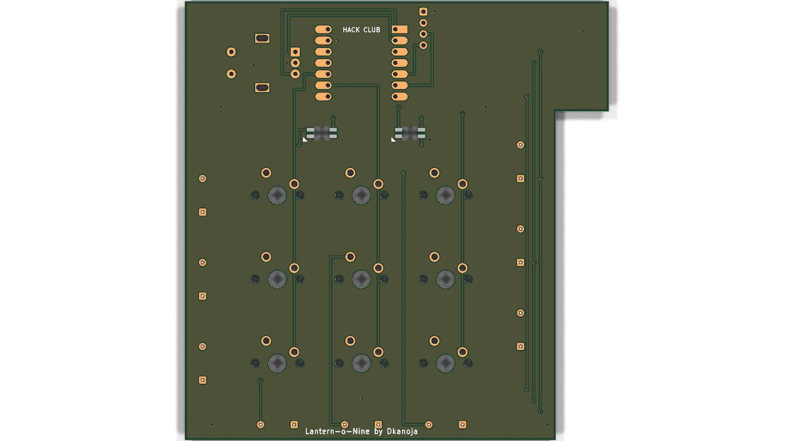
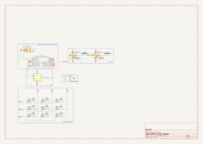
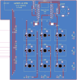

# **Lantern-o-Nine**

A 9-key custom macropad built around the Seeed XIAO RP2040, featuring an EC11 rotary encoder for volume control, a 0.91" OLED display to show current status, and SK6812 RGB underglow. Housed in a custom 3D printed snap-fit case with a honeycomb vent rosette and debossed name!

Made as a submission to [Hack Club's Hackpad](https://hackpad.hackclub.com/) program.  
> *This is my first hardware project! Thank you Hack Club for this amazing opportunity!! <3*

---

<p align="center">
  
</p>

### Quick Links
- [View CAD Files](./CAD/)
- [View PCB Files](./PCB/)
- [View Firmware](./Firmware/)
- [View Production Files](./production/)

---

## Pictures & Design Files

### 3D PCB Renders
| Top View | Bottom View |
| :---: | :---: |
|  |  |

### Schematic & PCB Routing
| Schematic Diagram | 2D PCB Layout |
| :---: | :---: |
|  |  |

---

## Features
- **9 Cherry MX Mechanical Switches** in a 3x3 matrix with 1N4148 diodes so there's zero ghosting (NKRO).
- **EC11 Rotary Encoder** to smoothly change volume up/down, plus click-to-mute.
- **0.91" 128x32 I2C OLED Display** showing the active layer and status.
- **2x SK6812MINI-E Reverse-Mount RGB LEDs** shining through cutouts in the PCB for nice underglow.
- **Custom 3D Printed Case** with a 2mm switch plate, recessed PCB mounting ledge, USB-C cutout, debossed "Lantern-o-Nine" logo, and a little honeycomb vent pattern on the bottom!

---

## Components Used (BOM)

All parts are beginner friendly and follow the Hack Club approved parts list:

- **Seeed Studio XIAO RP2040** (1x)
- **Cherry MX / Gateron switches** (9x)
- **1N4148 switching diodes (DO-35)** (9x)
- **EC11 rotary encoder with push button** (1x)
- **0.91 inch SSD1306 I2C OLED display (128x32)** (1x)
- **SK6812MINI-E reverse-mount addressable RGB LEDs** (2x)
- **0805 SMD 0.1uF decoupling capacitors** (2x)
- **3D printed top plate and bottom case** (Printed in PLA/PETG)

---

## Xiao RP2040 Pinout

| Pin | GPIO | What it connects to |
| :--- | :--- | :--- |
| **D0** | GPIO26 | Encoder Pin B |
| **D1** | GPIO27 | Encoder Pin A |
| **D2** | GPIO28 | Matrix Row 1 (Diodes D1, D2, D3) |
| **D3** | GPIO29 | Matrix Row 2 (Diodes D4, D5, D6) |
| **D4** | GPIO6  | OLED Display SDA (I2C) |
| **D5** | GPIO7  | OLED Display SCL (I2C) |
| **D6** | GPIO0  | Matrix Row 3 (Diodes D7, D8, D9) |
| **D7** | GPIO1  | Matrix Column 1 (Switches SW2, SW5, SW8) |
| **D8** | GPIO2  | Matrix Column 2 (Switches SW3, SW6, SW9) |
| **D9** | GPIO4  | Matrix Column 3 (Switches SW4, SW7, SW10) |
| **D10**| GPIO3  | RGB LED Data Line (DIN) |
| **3V3**| 3.3V   | Power to OLED Display |
| **5V** | 5.0V   | Power to SK6812 RGB LEDs |
| **GND**| GND    | Ground Plane |

---

## Firmware (CircuitPython + KMK)

The firmware is super simple and runs using [KMK](https://github.com/KMKfw/kmk_firmware) on CircuitPython.

### How to set it up:
1. Hold the `BOOT` button on the Xiao RP2040 while plugging it into your computer with a USB-C cable.
2. Drag and drop the CircuitPython `.uf2` file for Xiao RP2040 from [circuitpython.org](https://circuitpython.org/board/seeed_xiao_rp2040/).
3. Once the drive reboots as `CIRCUITPY`, download [KMK Firmware](https://github.com/KMKfw/kmk_firmware) and copy the `kmk/` folder into the `CIRCUITPY` drive.
4. Copy [`Firmware/main.py`](./Firmware/main.py) into the `CIRCUITPY` drive and rename it to `code.py`.

### 3-Mode Layout:
- **Top Row (Mode Switchers):** Key 1 = Spotify Mode | Key 2 = Git Mode | Key 3 = Code Mode
- **Mode 1 (Spotify):** Prev Track, Play/Pause, Next Track, Vol Down, Mute, Vol Up
- **Mode 2 (Git):** `git status`, `git add .`, `git commit`, `git push`, Toggle Terminal (`Ctrl+~`), Clear (`Ctrl+L`)
- **Mode 3 (Code):** Copy (`Ctrl+C`), Paste (`Ctrl+V`), Cut (`Ctrl+X`), Undo (`Ctrl+Z`), Redo (`Ctrl+Y`), Format (`Shift+Alt+F`)
- **Rotary Knob:** Turn clockwise for Volume Up, counter-clockwise for Volume Down.

---

## Repository Structure

```text
lantern-o-nine/
├── README.md                 # This file!
├── .gitignore                # KiCad gitignore
├── CAD/
│   └── assembled-model.STEP  # Full 3D assembly of case + PCB
├── PCB/
│   ├── hackpadtrial.kicad_pro# KiCad 10 project file
│   ├── hackpadtrial.kicad_sch# Schematic
│   ├── hackpadtrial.kicad_pcb# PCB Layout (96mm x 99.5mm, 2-layer, 0 DRC errors)
│   └── hackpadtrial.kicad_prl# KiCad settings
├── Firmware/
│   └── main.py               # CircuitPython & KMK keyboard code
├── production/
│   ├── gerbers.zip           # Gerbers and drill files for JLCPCB
│   ├── Top.STEP              # Switch plate 3D file
│   ├── Bottom.STEP           # Bottom case 3D file
│   └── main.py               # Production firmware copy
└── images/
    ├── render_iso.png
    ├── render_top.png
    ├── render_bottom.png
    ├── schematic.svg
    └── pcb_layout.svg
```

---

## Credits

Built by **Dhyaan Kanoja** ([@DhyaanKanoja11](https://github.com/DhyaanKanoja11)).  
Special thanks to **Atulya** ([@Person-0](https://github.com/Person-0)) for help and inspiration from his awesome [Spicofy](https://github.com/Person-0/spicofy) project!  
Huge shoutout to the **Hack Club** team and everyone on the Slack helping high schoolers build real hardware! <3
